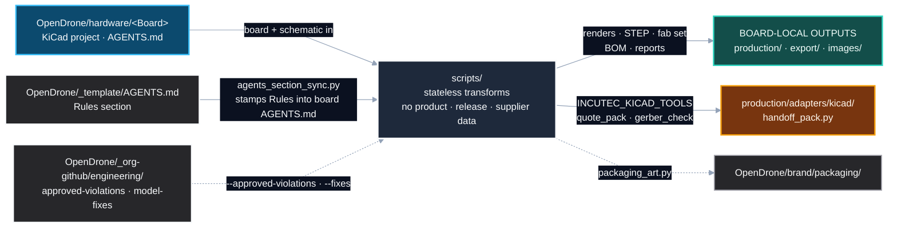
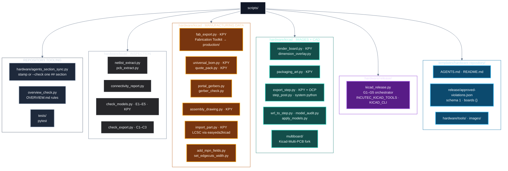
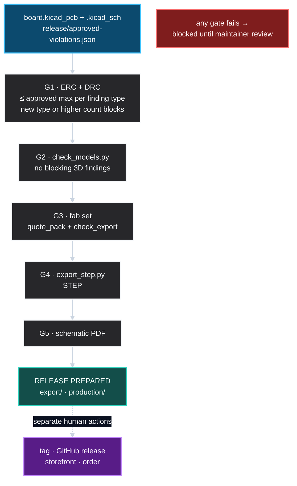
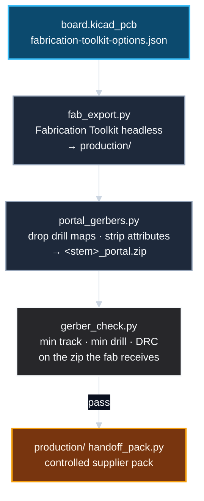
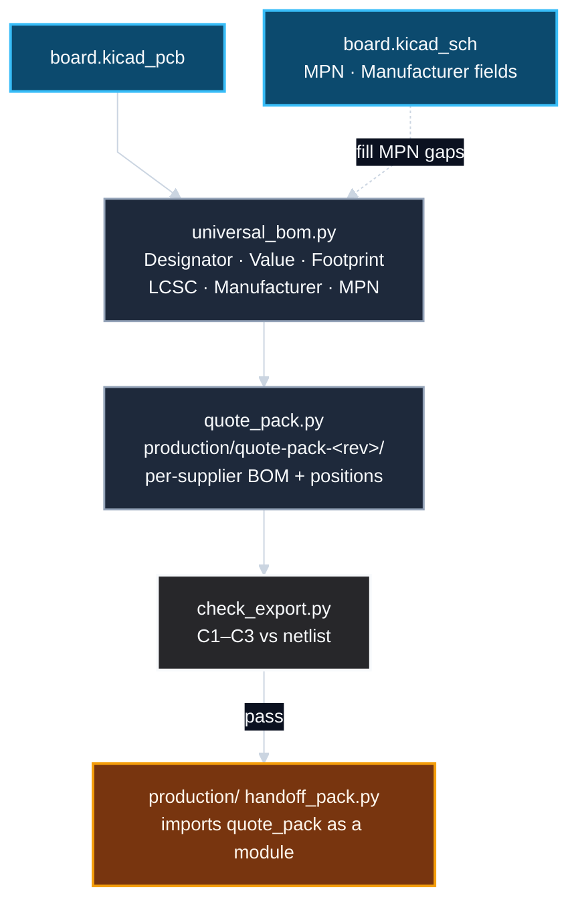
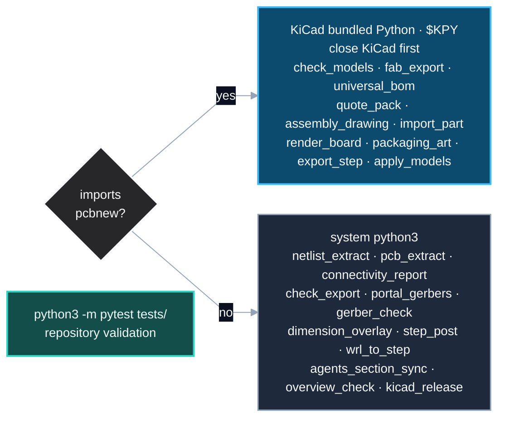

# Incutec hardware tooling

## Position in the workspace

## Tool map

## Release gate chain

## Manufacturing data paths

### Fabrication set

### BOM and quote pack

### Part import

## Interpreter rule

