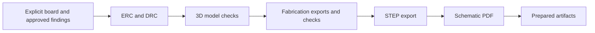

# Incutec hardware tooling

Hardware-agnostic automation and repository templates used by Incutec to
create, inspect, release, and hand off hardware projects. Product portfolios
keep their own policy, accepted exceptions, naming, and
publication orchestration in their own repositories.

The repository is intentionally split by concern:

```text
hardware/kicad/                 reusable KiCad inspection and export tools
hardware/release/               hardware release preparation and approval gates
hardware/agents_section_sync.py copy one Markdown section from a template into files
templates/hardware-repository/  generic starting point for a hardware repo
docs/                           repository-agnostic documentation scanning
overview_check.py               check a repository's OVERVIEW.md visual index
tests/                          regression tests
```

## Requirements

Most board tools require KiCad's bundled Python because they import `pcbnew`:

```sh
KPY=/Applications/KiCad/KiCad.app/Contents/Frameworks/Python.framework/Versions/Current/bin/python3
$KPY hardware/kicad/render_board.py path/to/board.kicad_pcb --outdir images
```

Tools that use only the Python standard library run with `python3`.
`cam_compare.py` also needs numpy, scipy, pillow and gerbonara 1.6.3, installed
without gerbonara's web dependencies: `python3 -m pip install --no-deps gerbonara==1.6.3`. STEP repair
and post-processing tools additionally require `cadquery-ocp`. Read `--help`
before using a tool that writes source files; writes are opt-in unless the
command explicitly says otherwise.

## Board inspection

| Tool | Purpose |
| --- | --- |
| `netlist_extract.py` | Export component, sheet, and power-net summaries from a KiCad netlist. |
| `pcb_extract.py` | Export footprints, pad connectivity, and net counts from a board. |
| `connectivity_report.py` | Produce CSV and Markdown connectivity reports. |
| `check_models.py` | Check board and library 3D-model references before export. |
| `check_export.py` | Compare a fabrication export with its board and schematic. |

## Manufacturing data

| Tool | Purpose |
| --- | --- |
| `fab_export.py` | Run the KiCad Fabrication Toolkit headlessly. |
| `universal_bom.py` | Generate a manufacturer/MPN-aware BOM. |
| `quote_pack.py` | Assemble generic and supplier-formatted fabrication inputs. |
| `portal_gerbers.py` | Produce a compatibility copy for limited upload parsers. |
| `gerber_check.py` | Classify and validate a Gerber archive. |
| `cam_compare.py` | Compare a fabricator's CAM Gerbers with the released set and review the differences in an interactive workspace with an editable, exportable report. |
| `assembly_drawing.py` | Render per-side assembly drawings with pin-1 markings. |
| `assembly_pack.py` | Interactive BOM, assembly PDF, and a duplicate/unsourced reference report for fab review. |
| `import_part.py` | Import an LCSC part into an explicitly selected project library. |
| `set_edgecuts_width.py` | Normalize `Edge.Cuts` widths; dry-run unless `--write` is passed. |

## Fabricator CAM review

A fab returns its own CAM output ("work" or "working" Gerbers) for
confirmation: flattened panels, fab layer names, etch and drill compensation,
removed non-functional pads. `cam_compare.py` locates every board instance in
that panel from the drill pattern and compares it layer by layer, hole by hole
and net by net with the released Gerbers, then writes a review workspace:

```sh
python3 hardware/kicad/cam_compare.py --design release.zip --cam fab_cam.rar -o review/
python3 hardware/kicad/cam_compare.py --serve -o review/     # edits saved to review/review.json
```

`review/index.html` also opens directly from disk; edits then stay in that
browser until exported. `--help` lists the checks and tolerances.

## Images and CAD exports

| Tool | Purpose |
| --- | --- |
| `render_board.py` | Render standardized top and bottom board PNGs. |
| `packaging_art.py` | Generate flat vector board artwork from PCB geometry in a caller-supplied palette. |
| `dimension_overlay.py` | Add dimensions to an existing board image. |
| `export_step.py` | Export normalized board STEP models. |
| `step_post.py` | Post-process STEP geometry using Open CASCADE. |
| `wrl_to_step.py` | Convert VRML meshes to STEP and repair model trees. |
| `model_audit.py` | Measure 3D-model cost and find replacement candidates. |
| `apply_models.py` | Apply an explicit model map or correction catalogue. |

All tools above live under `hardware/kicad/`. Batch operations require an
explicit root; project-specific values belong in the consuming repository.

`packaging_art.py` has no built-in palette: `--color` (pads, silkscreen, board
outline) and `--body` (component body fill) are required, and `--holes` and
`--png-bg` take the box background. The brand repository that owns the
packaging design supplies the values.

```sh
$KPY hardware/kicad/packaging_art.py path/to/board.kicad_pcb --outdir packaging/ \
  --color '#ffffff' --body '#0a0a0a' --holes '#0a0a0a' --png --png-bg '#0a0a0a'
```

## Documentation sync

`hardware/agents_section_sync.py` copies one `## <name>` section verbatim from
a template Markdown file into target files, or reports drift with `--check`
(exit 1 when any target differs). Product portfolios use it to keep a shared
section of their board `AGENTS.md` files identical to their template.
Missing required sections exit 1 in both modes, before any target is written.
Use `--skip-missing` only to explicitly exclude targets without that section.

```sh
python3 hardware/agents_section_sync.py --template _template/AGENTS.md \
  --section Rules --check boards/*/AGENTS.md
```

## Visual index check

`overview_check.py` validates an explicitly selected diagram-only `OVERVIEW.md`.
Use it for the workspace ownership map or another deliberately maintained visual
reference. Repository guides live in `README.md`; an overview is not required.
Pass one or more repository roots:

```sh
python3 overview_check.py /path/to/repo
```

## Release preparation

`hardware/release/kicad_release.py` composes the generic KiCad checks and
exports into a release-preparation chain. A design does not need an empty ERC
or DRC report: the command accepts a product or portfolio-owned approvals file
and passes findings at or below their reviewed maximum. A new finding or a
higher count blocks until a human reviews it.

```sh
python3 hardware/release/kicad_release.py path/to/board.kicad_pcb \
  --approved-violations path/to/approved-violations.json \
  --approval-key project/hardware/board
```

The preparation sequence is:



Publication and purchasing require their own approval after preparation.

## Multi-board plugin

`hardware/kicad/multiboard/` is an MIT-licensed fork of Kicad-Multi-PCB for
projects in which one schematic drives several PCB layouts. The upstream
licence is retained as `LICENSE.upstream`.

```sh
sh hardware/kicad/multiboard/install.sh
$KPY hardware/kicad/multiboard/update.py path/to/project [board ...]
```

## Documentation scanning

`docs/stale_check.py` (stdlib only) walks every git-tracked text file (`.md`,
`.txt`, `.json`, `.yml`, `.yaml`, `.toml`, `.py`, `.ts`, `.tsx`, `.sh`) of the
workspace root and of every repository in the root `repos.json` that exists
on disk, and reports `path:line:term` for a term list (a retired system stated
as current authority, an old contact address or domain, or leftover placeholder
text). The list also carries the path-glob allowlist for historical evidence
that must keep the words.

A term list names the systems, contact points and evidence trees of one
workspace, so it is that workspace's record and not tool configuration. The
scanner reads `<workspace-root>/.incutec/stale_terms.json` when it exists, and
otherwise `docs/stale_terms.example.json`, which documents the format with
generic placeholder terms. `--terms PATH` selects a list explicitly.

```sh
python3 docs/stale_check.py --workspace-root /path/to/workspace --summary
python3 docs/stale_check.py --workspace-root /path/to/workspace --repo erp --json
```

Exit status 1 when a hit exists outside the allowlist, 2 when the term list is
missing or an explicit `--repo` selection is unknown or unavailable. Default
discovery skips uncloned repositories. A directory inside another checkout
does not count as an independently cloned repository.

## Repository template

`templates/hardware-repository/` defines the hardware-agnostic repository
contract. A product organization may layer its own README, license, library,
status, community, and release profile on top.

## Ownership rule

A tool belongs here when its behavior works for unrelated hardware projects
through explicit inputs or configuration. Product names, portfolio topology,
accepted release exceptions, brand rules, and publication policy belong to
the product organization. Supplier conversations, orders, stock, test evidence,
and compliance records stay in their owning Incutec repositories.

MIT licensed. See `LICENSE`.
