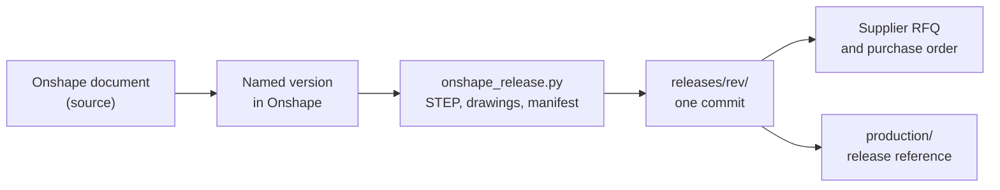

# Mechanical repository template

The standard for a mechanical product repository: a frame, a mount, an
enclosure, anything designed in CAD and made by a supplier from STEP, DXF
and drawings. Circuit boards use `../hardware-repository/` instead.

| | PCB repository | Mechanical repository |
|---|---|---|
| Design source | KiCad files in the repo | Onshape document, linked from `cad/onshape.json` |
| What the repo holds | Source and project-local libraries | The link to the source, released exports, parts list |
| Release output | `hardware/production/<rev>`, ignored until tagged | `releases/<rev>/`, tracked, one commit per release |
| Made by | PCB fab and assembly (JLCPCB) | CNC, laser, printing, injection moulding |
| Checks | ERC, DRC, approved violations | `mechanical_check.py`: layout, parts list, release hashes |
| Released by | KiCad Fabrication Toolkit | `onshape_release.py` in this scripts repository |



```text
repository/
├── AGENTS.md
├── README.md          what it is, a render, spec and parts tables
├── LICENSE            CERN-OHL-S-2.0
├── parts.csv          every part a set is made of, one row per part type
├── hardware.csv       standard parts: fasteners, standoffs, grommets
├── cad/
│   └── onshape.json   document, workspace, element and part ids
├── releases/
│   └── <rev>/         written by the release script, never by hand
│       ├── step/      one STEP per part
│       ├── drawings/  dimensioned drawings, PDF
│       └── manifest.json   Onshape version, file hashes, export date
├── docs/              design rationale and assembly notes
└── images/            renders and photos used by the README
```

## Rules

- The Onshape document is the source. A STEP, DXF or PDF is never edited;
  fix the model, make a new Onshape version and release again.
- One release is one commit that adds `releases/<rev>/` and nothing else, so
  `git log releases/` is the list of what suppliers were sent.
- A release directory is never changed after its commit. A correction is a
  new revision.
- `parts.csv` states the quantity per set. Suppliers quote per part type
  unless the quantity is explicit.
- Supplier quotes, prices and RFQ records stay in the private `sourcing`
  repository, never here.

## Check

```sh
python3 <scripts>/hardware/mechanical_check.py <repository>
```
